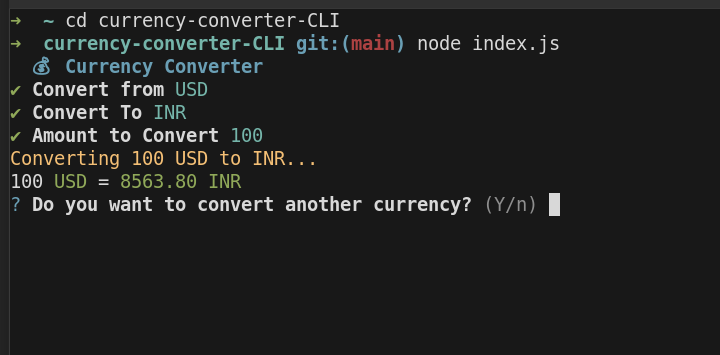

## Currency Converter CLI



- A command-line interface application for converting currencies in real-time using exchange rates from the ExchangeRate-API.

## Features
- Convert between 30+ major world currencies
- Interactive CLI interface using Inquirer
- Real-time exchange rates
- Clean and user-friendly interface


## Installation

1. Clone the repository
2. Install dependencies:
```bash
npm install
```

## Configuration

1. Create a `.env` file in the root directory
2. Add your ExchangeRate-API key:
```
API_KEY=your_api_key_here
```

You can get a free API key from [ExchangeRate-API](https://www.exchangerate-api.com/)

## Usage

Run the application:
```bash
node index.js
```

The application will prompt you with three questions:
1. Select the currency to convert from
2. Select the currency to convert to
3. Enter the amount to convert

## Dependencies

- dotenv
- axios
- inquirer
- chalk
